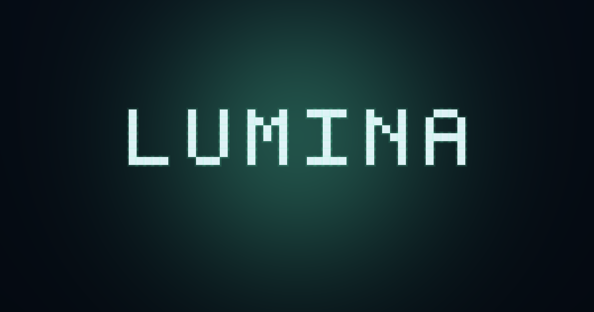

<div align="center">



# LUMINA — 光の遊び場

**触れて遊ぶ8つのGPUアート世界。ブラウザだけで動く光の遊び場。**
*Eight GPU worlds of light to touch and play, running entirely in your browser.*

**▶ https://benriworks.github.io/special/**
（GitHub Pages の設定後に公開されます / goes live after Pages setup — see [公開手順](#公開手順) / [Deployment](#deployment)）

</div>

---

## 日本語

### ✦ 8つのモード

| # | モード | ひとこと |
|---|--------|----------|
| 1 | 流体 *Fluid* | 指でかき混ぜる光の流体 |
| 2 | 銀河 *Galaxy* | 腕の中で渦巻く銀河 |
| 3 | 群れ *Flock* | 光の群れが指を追う |
| 4 | 反応拡散 *RD* | 生命のように育つ模様 |
| 5 | 文字 *Moji* | 文字がほどけて光になる |
| 6 | 花火 *Hanabi* | 夜空に咲いて、散る光 |
| 7 | 遊泳 *Drift* | 星の海を、ただよう |
| 8 | 重力 *Gravity* | 光さえ、曲がって落ちる |

### 操作

| キー / ジェスチャ | 動作 |
|---|---|
| `1` – `8` | モード切替 |
| `Space` | パルス |
| `F` | 全画面 |
| `S` | PNG保存 |
| `T` | テーマ切替 |
| `L` | 言語切替（日本語 / English） |
| `M` | マイクで反応 ON/OFF |
| `H` | バーを隠す |
| `?` | このサイトについて |
| ドラッグ | 光をかき混ぜる |
| 2本指タップ | パルス |
| バーを左右スワイプ | モード切替 |
| テーマドットを長押し | パレットを開く |

### テーマ

オーロラ **Aurora** ／ 焔 **Ember** ／ 桜 **Sakura** ／ 深海 **Abyss** ／ 墨 **Sumi**

### 音に反応（マイク）

バーのマイクボタン（または `M` キー）をオンにすると、8つのモードすべてが周囲の音——音楽、拍手、声——にほのかに反応します。初回はブラウザがマイクの使用許可を求めます。

> マイクの音は端末内で解析されるだけ。録音も送信もされません。

### 展示モード

URL に `#kiosk=1` を付けると、展示・イベント向けの振る舞いになります:

- **画面スリープ防止** — Screen Wake Lock を自動取得し、タブ復帰時や解除時にも取り直します（対応ブラウザのみ。非対応環境では静かに何もしません）
- **自動巡回** — 無操作が90秒続くと次のモードへ。誰かが触れている間は決して切り替わりません
- おすすめ設定: タブレットでは「ホーム画面に追加」からフルスクリーンで起動し、開始モードやテーマも URL で固定します

```
https://benriworks.github.io/special/#kiosk=1&m=hanabi&t=sumi
https://benriworks.github.io/special/#kiosk=1&m=gravity&t=ember
```

### AIチームがつくりました

このサイトは、Claude がオーケストレーションする複数のAIエージェントのチームによって、設計から実装、レビューまで一貫して作られました。エンドロール風にご紹介します。

| 役割 | 担当 |
|---|---|
| 監督 | オーケストレーター（Claude） |
| 企画・デザイン | デザインパネル・エージェント |
| 基盤 | ファウンデーション・エンジニア |
| グラフィックス | 8人のモード・エンジニア（並列作業） |
| QA | 敵対的レビュー・エージェント |
| 検証 | 自動検証ハーネス |

各ビジュアルモードは専属のエージェントが実装し、別のエージェントが批評と検証を行いました。完璧なチームだった…とは言いませんが、楽しいチームでした。

### 技術メモ

- **Vite + TypeScript + 素のWebGL2** — フレームワークなし、ランタイム依存ゼロ
- **サーバーなし・トラッキングなし** — すべての計算はあなたのデバイス上で完結します。何もアップロードされず、何も追跡されません
- 静的ファイルのみで動作（GitHub Pages で配信）

### ローカル開発

```bash
npm install
npm run dev      # 開発サーバー
npm run build    # 型チェック + 本番ビルド
npm run verify   # 受け入れテスト（設定済みの Playwright Chromium が必要）
```

### 公開手順

GitHub Pages（GitHub Actions 経由）で公開します。リポジトリのオーナーが行う手順:

1. GitHub でリポジトリを開く → **Settings** → **Pages**
2. **Build and deployment** → **Source** を **"GitHub Actions"** に設定
3. この設定より前に最初のワークフローが実行されていた場合は、**Actions** タブから該当ワークフローを **re-run**
4. サイトが https://benriworks.github.io/special/ に公開されます

### ライセンス

[MIT](./LICENSE)

---

## English

### ✦ Eight Modes

| # | Mode | One-liner |
|---|------|-----------|
| 1 | Fluid（流体） | Swirl a fluid of light with your fingers |
| 2 | Galaxy（銀河） | A galaxy spiraling in your hands |
| 3 | Flock（群れ） | A flock of light that follows you |
| 4 | RD（反応拡散） | Reaction–diffusion patterns that grow like living things |
| 5 | Moji（文字） | Characters dissolving into light |
| 6 | Hanabi（花火） | Fireworks that bloom and fall across the night |
| 7 | Drift（遊泳） | Adrift in a sea of stars |
| 8 | Gravity（重力） | Where even light bends and falls |

### Controls

| Key / Gesture | Action |
|---|---|
| `1` – `8` | Switch modes |
| `Space` | Pulse |
| `F` | Fullscreen |
| `S` | Save PNG |
| `T` | Cycle theme |
| `L` | Toggle language (日本語 / English) |
| `M` | Toggle sound reactivity |
| `H` | Hide the bar |
| `?` | About overlay |
| Drag | Stir the light |
| Two-finger tap | Pulse |
| Swipe on the bar | Switch modes |
| Long-press a theme dot | Open the palette |

### Themes

**Aurora**（オーロラ） / **Ember**（焔） / **Sakura**（桜） / **Abyss**（深海） / **Sumi**（墨）

### Sound Reactivity (Microphone)

Turn on the mic button in the bar (or press `M`) and all eight modes subtly react to the sound around you — music, claps, voices. Your browser asks for microphone permission the first time.

> Microphone audio is analysed on your device only — never recorded, never uploaded.

### Exhibition Mode

Append `#kiosk=1` to the URL for exhibition / event-friendly behavior:

- **Keeps the screen awake** — acquires a Screen Wake Lock and re-acquires it when the tab returns or the lock is released (where supported; silently does nothing elsewhere)
- **Auto-cycling** — after 90 seconds with zero input it advances to the next mode; it never switches while someone is playing
- Recommended setup: on tablets, use "Add to Home Screen" to launch fullscreen, and pin the starting mode and theme in the URL

```
https://benriworks.github.io/special/#kiosk=1&m=hanabi&t=sumi
https://benriworks.github.io/special/#kiosk=1&m=gravity&t=ember
```

### Built by a team of AIs

This site was designed, built, and reviewed end-to-end by a team of AI agents orchestrated by Claude. Roll the credits:

| Role | Played by |
|---|---|
| Direction | Orchestrator (Claude) |
| Concept & design | Design panel agents |
| Foundation | Foundation engineer |
| Graphics | Eight mode engineers, working in parallel |
| QA | Adversarial review agents |
| Verification | Automated acceptance harness |

Each visual mode was implemented by its own dedicated agent, with other agents critiquing and verifying the result. We won't claim the team was perfect — but it was a fun one.

### Tech Notes

- **Vite + TypeScript + raw WebGL2** — no frameworks, zero runtime dependencies
- **No servers, no tracking** — everything is computed on your device; nothing uploaded, nothing tracked
- Ships as plain static files (served by GitHub Pages)

### Local Development

```bash
npm install
npm run dev      # dev server
npm run build    # type-check + production build
npm run verify   # acceptance tests (needs the preconfigured Playwright Chromium)
```

### Deployment

Deployed via GitHub Pages (through GitHub Actions). Owner steps:

1. Open the repository on GitHub → **Settings** → **Pages**
2. Under **Build and deployment**, set **Source** to **"GitHub Actions"**
3. If the first workflow ran before this setting existed, go to the **Actions** tab and **re-run** it
4. The site appears at https://benriworks.github.io/special/

### License

[MIT](./LICENSE)
